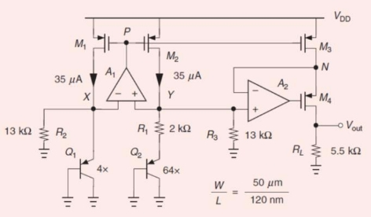

Final project:   A Low-Voltage Bandgap Reference 

Fig. 1 

|Table I  0.18um Virtual Process  ||
| :- | :- |
|Single supply voltage  |1\.5V±10% |
|Output voltage  |0\.4~0.5V |
|Output voltage variation  |<5mV from 00C to 1000C |
|Power supply rejection ratio  |>40dB |
|Power |<2mW |

Design  a  low-voltage  bandgap  reference  in  Fig.  1  [1]  to  meet  the specifications in Table I. [1] B. Razavi, The Design of a Low-Voltage Bandgap Reference, IEEE SOLID-STATE CIRCUITS MAGAZINE, pp. 6-12, Summer 2021. 

1) Describe your design procedure (40%) 
1) Please show the simulation results to verify the specifications in Table I (40%) 
1) Summarize (a) and (b) in a two-column report by no more than four- pages (A-4) (20%). 
